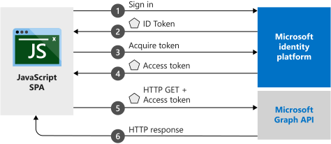

# Authenticating a React application with Azure AD 

This demo starts with `create-react-app` and adds authentication to it using Azure Active Directory.

The login is token based using JWT which means the flow for a request is several steps:

## Register a new app:
   
Azure Portal -> Azure Active Directory -> App registrations
 
Click on "New registration
* Enter the name of the application (clientapp for this demo)
* Tick Accounts in any organizational directory
* Add redirect URI (http://localhost:3000 for this demo)
* Register

After the app is created go to Authentication
* Tick Access Tokens
* Tick ID Tokens
* Save

After registering the application you need to update th `adalConfig.js` with the tenant and clientId.

You can get these from the portal or with the azure cli:

    az account get-access-token --query tenant --output tsv
    az ad app list --display-name clientapp|grep appId

### Errors

If you don't tick ID Tokens after creating the registration you will get the following error when the login page opens:

    'AADSTS700054: response_type 'id_token' is not enabled for the application.

If the redirect URI you put in the portal doesn't match what you have in the config you will get the following error:

    AADSTS50011: The reply url specified in the request does not match the reply urls configured for the application: '<app-id>'. 
